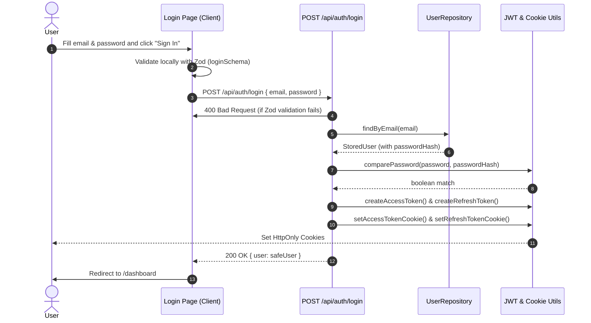
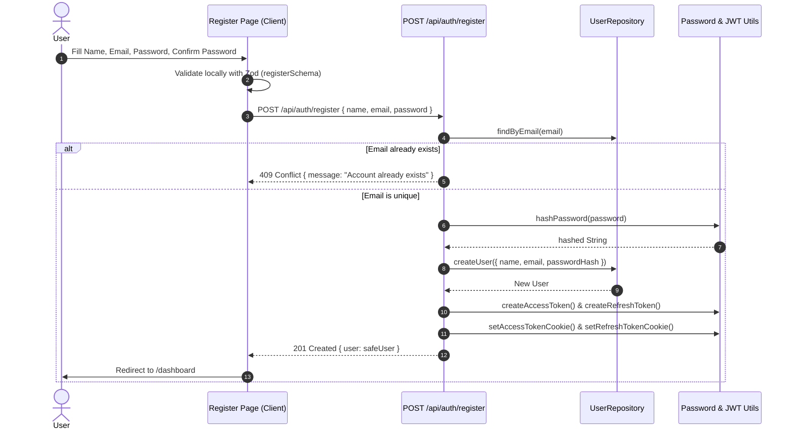

# DevBoard Architecture

## Purpose
A technical showcase project demonstrating modern Next.js App Router architecture, React Server Components, TypeScript, and frontend engineering best practices.

## Goals
- Master Next.js App Router
- Master React Server Components
- Master TypeScript
- Demonstrate clean architecture
- Build a portfolio-ready project
- Prepare for Senior Frontend interviews

### Layout

src/
│
├── app/
│   │
│   ├── layout.tsx                 // Root Layout
│   │
│   ├── globals.css
│   │
│   ├── (public)/
│   │      │
│   │      ├── layout.tsx
│   │      └── page.tsx
│   │
│   ├── (auth)/
│   │      │
│   │      ├── layout.tsx
│   │      ├── login/
│   │      │      └── page.tsx
│   │      ├── signup/
│   │      │      └── page.tsx
│   │      └── forgot-password/
│   │             └── page.tsx
│   │
│   └── (app)/
│          │
│          ├── layout.tsx
│          ├── dashboard/
│          │      └── page.tsx
│          ├── projects/
│          │      └── page.tsx
│          └── settings/
│                 └── page.tsx
│
├── components/
│      ├── layout/
│      └── ui/
│
├── features/
│
├── lib/
│
├── services/
│
├── types/
│
└── hooks/

1. Update the Folder Structure

Our folder structure has evolved.

src/
├── app/
│
├── components/
│   ├── layout/
│   │   ├── AppShell/
│   │   ├── Header/
│   │   ├── Sidebar/
│   │   └── Breadcrumb/
│   │
│   └── ui/
│
├── config/
│   └── navigation.ts
│
├── features/
├── hooks/
├── lib/
├── services/
├── types/
Decision

A dedicated config folder was introduced to separate application configuration from rendering logic.

## Reason

Configuration such as navigation is application metadata, not UI logic. Keeping it separate makes it easier to maintain, extend, and test.

## Application Shell

The authenticated part of the application is wrapped inside an AppShell.

Responsibilities:

- Render Header
- Render Sidebar
- Render Main Content

The AppShell should not:

- Fetch business data
- Manage authentication
- Maintain application state
- Contain page-specific logic

Reason:

Keeps layout responsibilities isolated from business features.

## Sidebar Architecture

Sidebar is implemented as a Server Component.

Responsibilities:

- Render application logo
- Render navigation container
- Compose child components

Sidebar intentionally does not contain client-side routing logic.

Instead, the Navigation component is responsible for active route detection.

Reason:

Keeps the Sidebar server-rendered while minimizing client-side JavaScript.

## Navigation

Navigation is implemented as a Client Component.

Responsibilities:

- Read the current pathname using usePathname()
- Determine the active navigation item
- Render NavItem components

Reason:

Only active route detection requires client-side routing information.

The rest of the Sidebar remains server-rendered.

## NavItem

NavItem is a presentation component.

Responsibilities:

- Render a single navigation link
- Apply active styling

NavItem should not contain routing logic.

Reason:

Keeps presentation separate from navigation behavior.

## Server First Philosophy

The project follows a Server First approach.

Default to Server Components.

Only introduce Client Components when browser-only capabilities are required.

Examples:

- useState
- useEffect
- Browser APIs
- Event handlers
- usePathname()
- useSearchParams()

Whenever possible, isolate client-side behavior into the smallest possible component.

## Projects Feature Architecture

The Projects feature is the first business feature of the application.

The feature follows a feature-based architecture where all project-related logic is colocated.

Folder Structure:

features/
└── projects/
    ├── components/
    │   ├── ProjectList.tsx
    │   ├── ProjectCard.tsx
    │   ├── ProjectStatusBadge.tsx
    │   └── index.ts
    │
    ├── mocks/
    │   └── projects.mock.ts
    │
    ├── services/
    │   └── project.service.ts
    │
    ├── types/
    │   └── project.ts
    │
    └── constants/

Reason:

- Keep all business logic related to Projects in one location.
- Improve discoverability.
- Allow the feature to scale independently.
- Avoid scattering project-related code across the application.

## Projects Component Hierarchy

ProjectsPage (Server)
│
└── ProjectList (Server)
    │
    └── ProjectCard (Server)
        │
        └── ProjectStatusBadge (Server)

Reason:

Each component has a single responsibility.

ProjectsPage

- Owns data fetching.

ProjectList

- Renders a collection of projects.

ProjectCard

- Displays information for one project.

ProjectStatusBadge

- Encapsulates status presentation.

## Projects Data Flow

The Projects page owns data fetching.

Flow:

ProjectsPage
    ↓
ProjectService
    ↓
ProjectList
    ↓
ProjectCard

Reason:

The page owns the business data.

Child components receive data through props and remain reusable presentation components.

This follows top-down data flow.

## Domain Model

Project is modeled as a business entity.

Fields:

- id
- name
- description
- status
- owner
- createdAt
- updatedAt
- isFavorite

Status uses a TypeScript string union instead of a generic string.

Reason:

Only valid statuses should exist.

Owner is represented as a User object instead of a string.

Reason:

The relationship can grow to include avatar, email, permissions, and other user metadata.

Dates are represented as Date objects inside the UI layer.

Reason:

The UI should work with date objects for formatting and comparison.

API responses may later be transformed into this model.

## Mock Data Strategy

The application currently uses mock data.

Mock data is stored inside:

features/projects/mocks

The service layer consumes mock data instead of embedding arrays directly inside services.

Reason:

Keeps the service layer independent of the data source.

Future migration to REST or GraphQL APIs should only require updating the service implementation.

## Projects Rendering Strategy

ProjectsPage

Server Component

ProjectList

Server Component

ProjectCard

Server Component

ProjectStatusBadge

Server Component

Reason:

The feature currently contains no client-side interactivity.

Interactive elements should be isolated into dedicated Client Components only when required.

Example:

FavoriteButton

SearchInput

ProjectFilters

## Planned Client Components

The following components will become Client Components only when introduced:

- SearchInput
- FavoriteButton
- ProjectFilters
- Pagination
- SortDropdown

Reason:

Follow the Server First philosophy while minimizing client-side JavaScript.

### Domain Model Changes
Before
Project
├── id
├── name
├── description
├── status
├── owner
├── createdAt
├── updatedAt
└── isFavorite
After
Project
├── id                // Internal unique identifier
├── slug              // Public URL identifier
├── name
├── description
├── status
├── owner
├── createdAt
├── updatedAt
└── isFavorite

Decision: Public routing uses slug instead of id. Internal id remains available for backend integration, database relations, and future APIs.

Route Flow
URL
      │
      ▼
slug
      │
      ▼
getProjectBySlug(slug)
      │
      ▼
Project
      │
      ▼
Project Details UI
Decision
Dynamic routes use project slugs.
Slugs provide readable and shareable URLs.
Internal IDs are never exposed in URLs.
Future backend APIs may still use IDs internally.

## Project Details Architecture

Add a new section.

Project Details Page

Project Details Page (Server)
        │
        ▼
getProjectBySlug(slug)
        │
        ▼
ProjectDetails
        │
        ├── ProjectHeader
        ├── ProjectDescription
        ├── ProjectOwner
        ├── ProjectMetadata
        └── ProjectStatusBadge

        ## Design System Decisions

### Product
- SaaS dashboard

### Theme
- Light and Dark mode

### Visual Style
- Minimal SaaS
- Neutral color palette
- Rounded modern cards
- Soft shadows
- Subtle animations

### Components
- Reusable UI primitives
- Consistent spacing
- Semantic status colors only

### Navigation
- Modern sidebar with rounded active item ("pill" style)

## Button

### Responsibility
Reusable button component for all application actions.

### Variants
- Primary
- Secondary
- Outline
- Ghost
- Destructive

### Sizes
- Small
- Default
- Large

### Accessibility
- Keyboard accessible
- Visible focus ring
- Supports disabled state

### Used By
- Projects
- Authentication
- Settings
- Dashboard

## Design System

### Purpose

The application maintains an internal UI Preview page that serves as a lightweight design system and component showcase.

### Location

app/(dev)/ui-preview

### Goals

- Validate UI primitives
- Test Light/Dark themes
- Verify responsiveness
- Showcase component APIs
- Reduce duplicated demo code

## Authentication Architecture

### Overview

DevBoard uses a custom JWT-based authentication mechanism built on Next.js App Router.

The authentication system is designed to be modular, secure, and scalable while following a feature-first architecture.

### Authentication Flow

#### Login Sequence Diagram

#### Registration Sequence Diagram

### Token Strategy

The application uses a dual-token approach.

#### Access Token

- Purpose: Authenticate API requests
- Lifetime: 15 minutes
- Storage: HttpOnly Cookie

#### Refresh Token

- Purpose: Generate new Access Tokens
- Lifetime: 7 days
- Storage: HttpOnly Cookie

### Security Decisions

- HttpOnly cookies
- Secure cookies in production
- SameSite=Lax
- Password hashing using bcryptjs
- JWT implementation using jose
- No authentication data stored in localStorage
- Middleware-based route protection

### Authentication Pages

/auth/login

/auth/register

/auth/forgot-password

/auth/reset-password

### Protected Routes

/projects

/dashboard

/settings

/profile

### Folder Structure

src/
├── app/
│   ├── (auth)/
│   └── api/auth/
│
├── features/
│   └── auth/
│       ├── components/
│       ├── services/
│       ├── validation/
│       ├── hooks/
│       └── types/
│
├── lib/
│   └── auth/
│       ├── jwt.ts
│       ├── cookies.ts
│       └── password.ts
│
└── middleware.ts

### Validation

- React Hook Form
- Zod

### Authentication API

POST /api/auth/register

POST /api/auth/login

POST /api/auth/logout

POST /api/auth/refresh

GET /api/auth/me

### Future Enhancements

- Email Verification
- Password Reset via Email
- Google OAuth
- GitHub OAuth
- Two-Factor Authentication
- Session Management